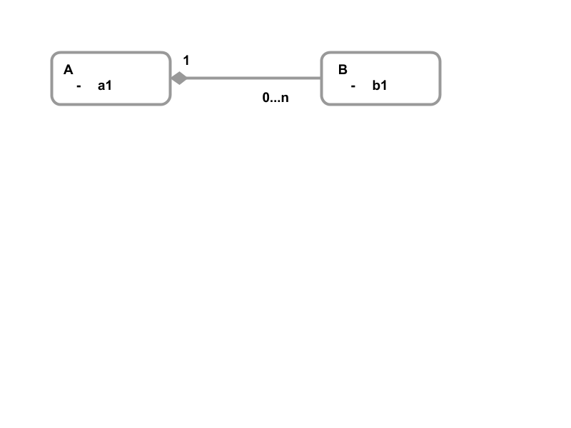

# Data Modeling in Aerospike

## What is Different?
Aerospike is a Key­-Value store ­so how you think about, model, and access your data is different. If you are coming from Entity­-Relationship modeling, normalization, and SQL schema design, then this series of articles should give you better context on how to tackle schema design with Aerospike. If you are coming from another NoSQL product, then some of these concepts may be familiar ­- carefully consider how to apply these to Aerospike and don't make any false assumptions!

## Key­-Value Data Models
At some level, a key­-value data model is simple. With a Primary Key value, you can look up the data associated with that key. In Aerospike, a record can be made up of:
* Scalar data types
  * Integers
  * Strings
  * Bytes
  * Doubles
* Complex data Types
  * Lists
  * Maps
  * Sorted Maps
  * GeoJSON

This allows a record to contain structure, as it's neither a binary blob nor solely made up of scalar values like some other key­value stores.

## Atomicity
In a relational model, a business object or domain object can represent a complex set of data and interdependencies (i.e. relationships or foreign keys). The process of normalization forces these domain objects to be split into smaller sets of structures in which data is not repeated. This manifests itself in multiple tables and foreign keys. To ensure that a write is atomic across these structures, most RDBMSs support multi­statement transactions. This allows all these disparate writes to either all be written, or all be rejected. But that leads to increased latency when you start to distribute the data across multiple machines - the transactions need to span all machines where data is being read from or written to, using a protocol like Two­-Phase Commit (2PC).

Distributed databases like Aerospike has been designed to scale horizontally, maintaining near linear scale as nodes are added. Aerospike’s operations have an absolute guarantee about atomicity: the operation either happens fully, or not at all. But unlike an RDBMS, there is no support for multi­statement transactions, since this breaks one of the rules for scaling in a distributed system. So how can you model complex data relationships with Aerospike and still have the right guarantees about atomicity?

## Encapsulation and Embedding
The Aerospike record defines the transactional boundary. But unlike an RDBMS record, an Aerospike record can describe a complex object and its relationship.



Figure­-1: Simple containment relationship

In Figure­-1, entity A entity encapsulates ­ or “owns” ­ all the associated B entities. When A is deleted, all the associated Bs are removed as well. In an RDBMS, you could implement this as two tables and a foreign key, with a delete cascade rule.

In Aerospike, you can implement this very differently. One alternative is to encapsulate the B instances within the A record. In JSON, this is shown an an array of objects:

```
A:
  { a1: "foo",
    B: [ {b1: "bar"}, {b1: "baz"}
       ]
  }
```

This means that instances of entity B are held in an array within the record A. Thus, removing record A implicitly removes the A record and all the encapsulated B records. Any operation that modifies record ```A```­ for example to set the attribute ```a1``` to "foobar" or to add or remove an element in the ```B``` array ­is still a single record operation, and thus, atomic.

## Linking
If we take the same example from Figure­-1, and change the names of ```A``` to ```Department``` and ```B``` to ```Employee```, how does this change the way we think about the data? It's reasonable that an ```Employee``` works for a specific ```Department``` right now, but perhaps last week, they transferred from another ```Department```. We could model this in the following way:


Figure­-2: Linking and 'Owning'

What this is saying is that each ```department``` has a number of ```assignments```, and each ```assignment``` is for a specific ```employee```. That ```assignment``` has a ```start_date``` so you can see the current (i.e., the most recent) and historical assignments. Bear in mind that there are many alternative models, but let’s concentrate on the generic patterns!
Using JSON again, here's one way that could be modeled:

```
departments:
  { name: "HQ",
    assignments: [ { ename: "Fred", start_date: "01-Jan-2016" },
                   { ename: "Anne", start_date: "18-Feb-2014" }
                 ]
  }

employees:
  {ename: "Fred", job_title: "Machinist"}
  {ename: "Anne", job_title: "Sales Exec"}
```

In this model, ```assignments``` have been encapsulated within the ```department```. Assuming ```ename``` is the Primary Key for the ```employees``` (please take this with a pinch of salt), you can use this information to make a second query on the ```employees``` to find any other details; for example, their ```job_title````. Aerospike, like many NoSQL databases, does not perform traditional joins like an RDBMS. Again, this is because the whole operation could mean coordinating many nodes to satisfy the query ­- which kills the overall latency of the operation.

Aerospike works on the basis that you can break down the operations into discrete steps. In our example, we can thus now perform two primary key accesses to obtain all the information required. But since these are now discrete operations, eventual consistent does come into play, since an interleaved reads will see changed data.

Any operation on ```department``` now encapsulates the ```assignment```; hence changes to either are atomic within a single operation, just as in the last example.

## Bi-­Directionality
We also need to consider that some relationship are directed in a single direction. Right now, we can find the ```employee``` within the department, but there is no simple way to find,for a given ```employee```,which ```department``` they work for. Our current model means that you have to look at each ```department``` and check if the ```employee``` has an active ```assignment```. For this relationship, we need to store links at both ends, as the following JSON describes:

```
departments:
  { name: "HQ",
    assignments: [ { ename: "Fred", start_date: "01-Jan-2016" }, 
                   { ename: "Anne", start_date: "18-Feb-2014" }
                 ]
  }

employees:
    {ename: "Fred", job_title: "Machinist", dept: "HQ" },
    {ename: "Anne", job_title: "Sales Exec", dept: "HQ" }
```

This adds some additional processing steps, as the link has to be maintained at both ends ­- for example, when an ```employee``` changes ```department```. We will deal with this issue in a separate blog post.

## Denormalization
Carrying on from the last example, it now means that you have to execute two Primary Key lookups in order to obtain an attribute for the employee (e.g., ```job_title```) ­ perhaps you have a summary screen to show all the active ```employees``` for a ```department```. If this is a frequent request, can we optimize this and avoid two lookups? The short answer is yes, through the process of denormalization. Remember that the process of normalization removes any repeated data, so it will come as no surprise that denormalization reintroduces that repeated data! The following JSON schema shows the denormalized ```job_title``` on the ```assignment```.

```
departments:
  { name: "HQ",
    assignments: [ { employee: { emp_name: "Fred", job_title: "Machinist" }, 
                     start_date: "01-Jan-2016" },
                   { employee: {emp_name: "Anne", job_tile: "Sales Exec" },
                     start_date: "18-Feb-2014" }
                 ]
  }

employees:
    {ename: "Fred", title: "Machinist", dept: "HQ" }
    {ename: "Anne", title: "Sales Exec", dept: "HQ" }
```

As you can see, we have now added or denormalized more that just the Primary Key of the ```employee``` into the ```assignment```. All the data required has been denormalized into this object, this removes the need for a second query. But this does not come for free. There is extra storage required, because we are now storing the same data (e.g. ```job_title```) multiple times. If "Anne" now get spromoted to a "VP of Sales" , then we potentially have to make multiple updates: once to the ```employee`` record, and once to the ```department``` record that encapsulates the ```assignment```.

For this use case, you can argue that perhaps you don't need to update the ```assignment```; you simply insert a new ```assignment``` into the array with the new ```job_tile``` and ```start_date```. You would probably need to update the ```employee``` record with the new ```job_title```, or simply remove the ```job_title``` from ``employee``` because the current ```title``` is on the ```assignment```.

As you can see, there are many choices, depending on your data requirements and use case.

# Summary

In this article, we covered the basic concepts of: 
* Encapsulation and Embedding
* Linking
* Denormalization

Other atricles in this series will cover
### TODO - add links
* [Faceted Query](faceting/README.md)
* [State Machines & Queue](/state_machines/README.md)
* [Inventory Control](/inventory/README.md)
* [Bucketing](/activity_stream/README.md)
* [Credit / Debit](/credit_debit/README.md)
* [Reparenting, bi­directional associations](/reparenting/README.md)
