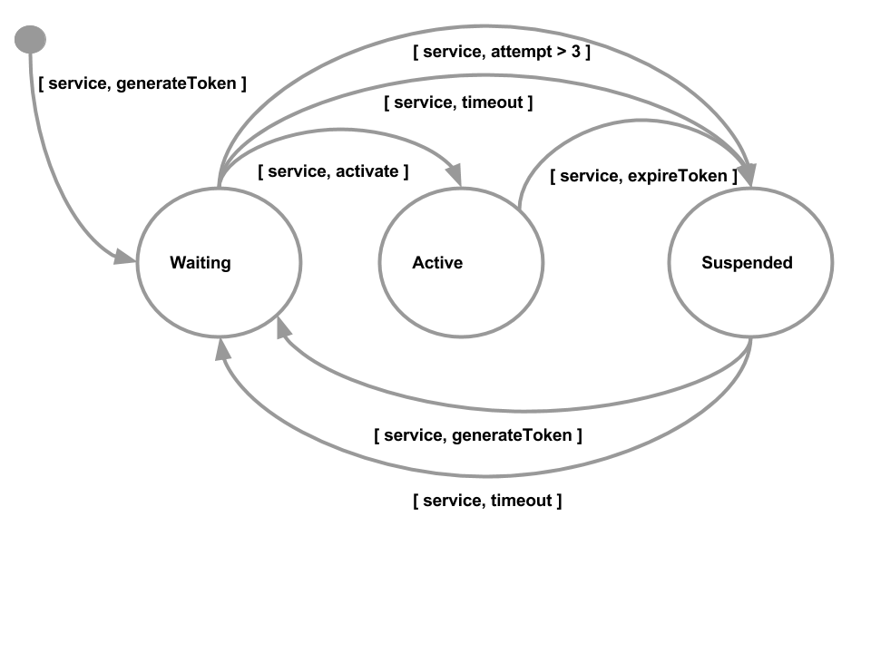

# State Machines & Queues
A common data pattern revolves around managing state and ensuring that transitions between states happen in a consistent way. This could be anything from a fulfillment process to workflows or other systems where you need to maintain state.

# Provisioning
Let's consider a simple provisioning system (see Figure­-1); it could be a signup form for a new web site, or automatic provisioning of infrastructure, etc. In this example, let's consider setting up your new Apple TV, Amazon Fire TV or Android TV device, and using one of the applications such as "NBC Sports".



**Figure­-1: State Machine for managing relationship end transfer**

The first time you use the "NBC Sports" application on the device, you are presented on screen with a Activation code. You then go the provider's web site with the code, enter it and after it performs an entitlement request to your cable provider, the application is activated.

As can be seen from the state diagram, each of these distinct steps is modeled as a state the system needs to track. Let's looks at a simple JSON representation of this schema:

```
account:
  { device_id: "ATV-123",
    last_logon_ts: 1469744519, 
    failed_logons: 0,
    tokens: { 'NBCSports': { token: "MTOB1J" } }
  }
```

The code required to provision the device is straightforward:

```python
import aerospike
import os
import time
import random
import string

config = { 'hosts': [(os.environ.get("AEROSPIKE_HOST", "127.0.01"), 3000)],
           'policies': { 'key': aerospike.POLICY_KEY_SEND }
}
wpolicy = {'gen': aerospike.POLICY_GEN_EQ}
mpolicy_create = {'map_write_mode': aerospike.MAP_UPDATE}

client = aerospike.client(config).connect()

def create_account(device):
  client.put(("test", "accounts", device),
             {'tokens': {} } )

def create_activation(event, device, service, token):
  client.put(("test", "events", event),
             { 'todo': [{'service': service, 'device': device, 'token': token }],
               'entitlement': [], 
               'devices': [],
             })

def generate_token():
  return ''.join(random.choice(string.ascii_uppercase + string.digits) \
    for _ in range(6))

def provision(device, service, token):
  (key, meta, record) = client.get(("test", "accounts", device))
  if token == "":
    token = generate_token()
  if service in record['tokens']:
    service = record['tokens'][service]
    if service['status'] in ["New", "Suspended"]:
      client.map_put(key, 'tokens', service, 
                     { 'token': token,
                       'ts': long(time.time()),
                       'status': "Waiting" },
                     { 'map_write_mode': aerospike.MAP_UPDATE },
                     meta, wpolicy)
  else:
    client.map_put(key, 'tokens', service, 
                   { 'token': token,
                     'ts': long(time.time()),
                     'status': "Waiting" },
                   { 'map_write_mode': aerospike.MAP_CREATE_ONLY},
                   meta, wpolicy)

device_id = "ATV-123"
service1 = "NBCSports"
token = "MTOB1J"
service2 = "ABC"

# Provision the device
create_account(device_id)
provision(device_id, service1, token)
(key, meta, record) = client.get(("test","accounts",device_id))
print record

provision(device_id, service2, "")
(key, meta, record) = client.get(("test","accounts",device_id))
print record
```

In order to track the activation token used by each application, we create a map structure. This allows a simple keyed access, so we can directly access the entry for "NBCSports", without the need to iterate through a list. As we can see in the ```provision``` function, we can directly access the correct item in the map. Per the state diagram in Figure­-1, the activation is put in the "Waiting" state, ready for the next steps.

When you run the code, you will see the following:

```
>>> provision(device_id, service1, token)
>>> (key, meta, record) = client.get(("test","accounts",device_id))
>>> print record
{'tokens': {'NBCSports': {'status': 'Waiting', 'token': 'MTOB1J', 'ts': 1470847607}}}
>>> provision(device_id, service2, "")
>>> (key, meta, record) = client.get(("test","accounts",device_id))
>>> print record
{'tokens': {'NBCSports': {'status': 'Waiting', 'token': 'MTOB1J', 'ts': 1470847607}, 'ABC': {'status': 'Waiting', 'token': 'HIBKMS', 'ts': 1470847720}}}
```

# Avoiding Updates by Other Threads and Processes
We have added a write policy ```AS_POLICY_GEN_EQ```, which ensures that the version number (or in Aerospike­ speak, “Generation”) is that same we read when we come to write the record. This ensures that nobody else has updated the record in the meantime. If the record was changed, then an exception will be thrown when the update is executed. There are several ways we can deal with that (e.g., re­query the record and try the transaction again, return an error to the user,
compensate on failure etc.), but that is beyond the scope of this article. The key point is that you can track these changes  - and act on them - programmatically.


# Tracking Service Activation Attempts
When a service tries to activate, then we want to track the following:
* Valid activation
* Invalid activation
  * Attempts are <= 3
  * Attempts are > 3
  * Service is already suspended

Lets look at the code to support this entitlement flow:

```python
def do_entitlement(device, service, token):
  (key, meta, record) = client.get(("test", "accounts", device_id))
  if service in record['tokens']:
    service_rec = record['tokens'][service]
    if service_rec['token'] == token:
      # Valid, so update last_logon_ts etc
        service_rec['failed'] = 0
        service_rec['last_logon_ts'] = long(time.time())
        service_rec['status'] = 'Active'
        client.map_put(key, "tokens", service, service_rec,
                       mpolicy_create, meta, wpolicy)
    else:
      if service_rec['status'] in ["Waiting", "Suspended"]:
        if service_rec['failed'] < 3:
          # increment and update last timestamp
          service_rec['failed'] +=1
          service_rec['last_logon_ts'] = long(time.time())
          client.map_put(key, "tokens", service, service_rec,
                         mpolicy_create, meta, wpolicy)
        else:
          # Exceeded limit
          service_rec['status'] = "Suspended"
          service_rec['last_logon_ts'] = long(time.time())
          client.map_put(key, "tokens", service, service_rec,
                         mpolicy_create, meta, wpolicy)
      else:
        # Record the attempt, even if the account is suspended
        client.put(key, {'last_logon_ts': long(time.time())})

# Entitlement will move the state, incorrect Token
do_entitlement(device_id, service1, token)
(key, meta, record) = client.get(("test", "accounts", device_id))
print record
```

The ```do_entitlement``` function transitions to the various states, depending on the evaluation of the current state. When you run the code, you will see the following:

```
>>> # Entitlement will move the state, incorrect Token
... do_entitlement(device_id, service1, token)
>>> (key, meta, record) = client.get(("test", "accounts", device_id))
>>> print record
{'tokens': {'NBCSports': {'status': 'Active', 'last_logon_ts': 1470847832, 'token': 'MTOB1J', 'ts': 1470847607, 'failed': 0}, 'ABC': {'status': 'Waiting', 'token': 'HIBKMS', 'ts': 1470847720}}}
```

## Queues
Queues are a common structure when you need some guarantees of order, especially when you are processing a set of events with many separate processes or threads.

## Tracking Devices
Let's say the marketing team at NBC wanted to know every new service activation so that they could send you an offer. You would not want to hold up the activation process from happening, so this means that the activation now consists of two things:
* Activate the service for the device
* Add the device as eligible for offers, etc.

There are several ways to model this, but for our example, let's use a queue. What we will do is use the service activation request event to add an item to a queue. Then, all the interested processes can use this record to trigger subsequent processing. This means that we do not need multi­record transactions to activate and extend offers. We have one record that several separate processes can now manipulate independently. Here's an example of what that would look like in JSON:

```
events:
  { type: "service activation", 
    todo: [ { service: "ABC", device: "ABC-123" } ],
    entitlement: [ { service: "NBC Sports", device: "ABC-123" } ],
    device: [ { service: "NBC Sports", device: "ABC-123" } ]
  }
```

In the above example, we are going to use the ```todo``` list to track new incoming requests and the ```entitlement``` and ```device``` lists to track the separate workflows, so that each process can record its progress.

Let's take a look at the code to support this:

```python
def process_todo(queue):
  (key, meta, record) = client.get(("test", "events", queue))
  # Take the next todo and create new entries into each workflow
  todo = record['todo']
  if len(todo) > 0:
    item = todo[0]
    item['ts'] = 0
    operations = [
      {
        'op' : aerospike.OP_LIST_POP,
        'bin': "todo",
        'index': 0
      },
      {
        'op' : aerospike.OP_LIST_APPEND,
        'bin': "entitlement",
        'val': item
      },
      {
        'op' : aerospike.OP_LIST_APPEND,
        'bin': "devices",
        'val': item
      }

    ]
    (key, meta, record) = client.operate(key, operations, meta, wpolicy)  
```

Since we store all three lists on the same record, it means that we can atomically move items between these lists. The list structure is used to maintain an ordered list of items queued up for processing. In the ```process_todo``` function, we can remove the request from the list and add it onto the both the ```entitlement``` and ```device``` lists in one operation. Let’s look at the processing on the ```entitlement``` queue:

```python
def process_entitlement(queue):
  (key, meta, record) = client.get(("test", "events", queue))
  for i in range(len(record['entitlement'])):
    # Find a entitlement where the ts=0, i.e. has not been taken
    item = record['entitlement'][i]
    if item['ts'] == 0:
      item['ts'] = long(time.time())
      operations = [
        {
          'op' : aerospike.OP_LIST_SET,
          'bin' : "entitlement",
          'index': i,
          'val' : item
        }
      ]
      (key, meta, record) = client.operate(key, operations, meta, wpolicy)
      do_entitlement(item['device'], item['service'], item['token'])
      client.list_pop(key, "entitlement", i, meta, wpolicy)    
```

The ```process_entitlement``` function loops through the list of actions looking for any that have not started (i.e. ```ts==0```). The timestamp (```ts```) is used to indicate that the process is being worked on. We can use this to implement a routine to "unstick" or to restart the processing of the action in the case of failures, etc. This will be covered in the next blog post. As each action is marked as started, the ```do_entitlement``` function is then called to perform whatever functionality is required.

To complete the code for the ```device``` workflow:

```python
def process_entitlement(queue):
  (key, meta, record) = client.get(("test", "events", queue))
  for i in range(len(record['entitlement'])):
    # Find a entitlement where the ts=0, i.e. has not been taken
    item = record['entitlement'][i]
    if item['ts'] == 0:
      item['ts'] = long(time.time())
      operations = [
        {
          'op' : aerospike.OP_LIST_SET,
          'bin' : "entitlement",
          'index': i,
          'val' : item
        }
      ]
      (key, meta, record) = client.operate(key, operations, meta, wpolicy)
      do_entitlement(item['device'], item['service'], item['token'])
      client.list_pop(key, "entitlement", i, meta, wpolicy)    

# Create the activation event
create_activation("new device", device_id, "NBCSports", token)
# Process the outstanding todo
process_todo("new device")
process_device("new device")
process_entitlement("new device")
(key, meta, record) = client.get(("test","accounts",device_id))
print record
```

Running the code, you will see the following:

```
>>> # Create the activation event
... create_activation("new device", device_id, "NBCSports", token)
>>> # Process the outstanding todo
... process_todo("new device")
>>> process_device("new device")
>>> process_entitlement("new device")
>>> (key, meta, record) = client.get(("test","accounts",device_id))
>>> print record
{'tokens': {'NBCSports': {'status': 'Active', 'last_logon_ts': 1470847987, 'token': 'MTOB1J', 'ts': 1470847607, 'failed': 0}, 'ABC': {'status': 'Waiting', 'token': 'HIBKMS', 'ts': 1470847720}}}
```

# Summary
As you can see, building and manipulating data models to support state machines, queues and other structures is straight-forward with Aerospike.

In the next article, we will discuss how to manage a finite (and perishable) resource like tickets sales for the Olympics, and how to deal with reservations that you may need to back out on.