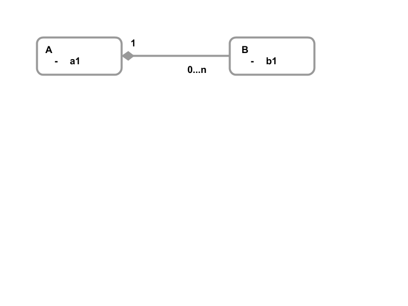

# Data Modeling in Redis

## What is Different?
Redis is a Key­-Value store ­so how you think about, model, and access your data is different. If you are coming from Entity­-Relationship modeling, normalization, and SQL schema design, then this series of articles should give you better context on how to tackle schema design with Redis. If you are coming from another NoSQL product, then some of these concepts may be familiar ­- carefully consider how to apply these to Redis and don't make any false assumptions!

## Key­-Value Data Models
At some level, a key­-value data model is simple. With a Primary Key value, you can look up the data associated with that key. In Redis, the following structures are available:

* Scalar data types
  * Strings
* Complex data Types
  * Hashes
  * Lists
  * Sets & Sorted Sets
  * Geo
  * HyperLogLogs

This allows a key to contain structure, as it's neither a binary blob nor solely made up of scalar values like some other key­-value stores.

## Atomicity
In a relational model, a business object or domain object can represent a complex set of data and interdependencies (i.e. relationships or foreign keys). The process of normalization forces these domain objects to be split into smaller sets of structures in which data is not repeated. This manifests itself in multiple tables and foreign keys. To ensure that a write is atomic across these structures, most RDBMSs support multi­-statement transactions. This allows all these disparate writes to either all be written, or all be rejected. But that leads to increased latency when you start to distribute the data across multiple machines - the transactions need to span all machines where data is being read from or written to, using a protocol like Two­-Phase Commit (2PC).

Distributed databases like Redis has been designed to scale horizontally, maintaining near linear scale as nodes are added. Redis operations have an absolute guarantee about atomicity: the operation either happens fully, or not at all. But unlike an RDBMS, there is no support for multi­statement transactions that span multiple nodes, since this breaks one of the rules for scaling in a distributed system. So how can you model complex data relationships with Redis and still have the right guarantees about atomicity?

## List, Set, Hash - how do I choose?
Redis has a complete set of data structures that allow modeling of complex domain objects. But those choice is which data structure to use - a List, Set, Sorted Set, Hash etc. Lets turn the question around, and ask about the access patterns or use case and then let this guide us to the correct data structure. This seems counterintuitive at first glance, so lets take an example. Lets say you have a counter that you need to increment, for example the number of times a specific cookie has been used to visit a website. We can use a simple key:

```
127.0.0.1:6379> set a3fWa 0
OK
127.0.0.1:6379> incr a3fWa
(integer) 1
127.0.0.1:6379> get a3fWa
"1"
```

If all we need to record is the current total, then this may be appropriate. Perhaps we would like to see this ordered by the count. In which case we could use a Sorted Set:

```
127.0.0.1:6379> zadd cookies 0 abc123
(integer) 1
127.0.0.1:6379> zadd cookies incr 1 a3fWa
"1"
127.0.0.1:6379> zrangebyscore cookies -inf +inf withscores
1) "abc123"
2) "0"
3) "a3fWa"
4) "1"
```


But perhaps there is other meta-data we need to record, for example the timestamp when we last saw the cookie:

```
127.0.0.1:6379> hmset a3fWa last_seen 1516384712.976586
OK
127.0.0.1:6379> hincrby a3fWa count 1
(integer) 1
127.0.0.1:6379> hgetall a3fWa
1) "last_seen"
2) "1516384712.976586"
3) "count"
4) "1"
```

The Hash datatype provides the ability to manage multiple fields in a flat structure, but we have now lost the ability to get an overall ordered list of the total hits for each cookie. So what's the best solution. Well, the answer is "it depends", and as we will see in this series of articles you will combine a number of the data structures in order to solve a given problem and set of use cases. Don't get frustrated that this may not always seem obvious, some experimentation is required as you get familiar with Redis!

## Keys
A Redis key is the fundamental building block of data structures within Redis. The key is a unique identifier for the data structure it encapsulates or points at. Redis has no explicit key or namespacing, keys are held in a flat namespace. Its customary to use a dotted or colon delineation for the parts of the key, for example:

```
127.0.0.1:6379> set "employee:Fred" 415-123-4567

127.0.0.1:6379> hmset "employee:Anne" "phone" 650-123-4567 "zipcode" 94107
```

In these examples ```employee:Fred``` and ```employee:Anne``` is the actual key value. Therefore, key namespace design is a critical part of designing data structures in Redis, especially to avoid key clashes for dis-similar values, e.g. a part number and employee identifier having the same key value. Operators are available so that you can check if a key exists (or not) before setting a value.

## Lists & Sets
Redis allow modeling of complex data structures, which is achieved by using multiple structures to represent all the required elements. If you are coming from an RDBMS or a Document Database, then you have to start thinking how you break logical structures like records or documents into multiple structures in Redis.



**Figure­-1: Simple containment relationship**

In Figure­-1, entity A entity encapsulates ­ or “owns” ­ all the associated B entities. When A is deleted, all the associated Bs are removed as well. In an RDBMS, you could implement this as two tables and a foreign key, with a delete cascade rule.

In Redis, you can implement this very differently. One alternative is to encapsulate the B instances within the A record. In JSON, this is shown an an array of objects:

```
A: "foo"
{
  a1: "foo"
}

B: "A:foo" 
{
  [ {b1: "bar"}, {b1: "baz"} ]
}
```

This means, we have two data structures to represent both the A and B entities, and we use a compound key in the B entity to describe the relationship, in the example about ```A:foo``` represents the Entity A and the Key value ```foo``` we associating with. Redis has not internal concept of referential integrity, and like many NoSQL databases, Redis relies on the application code and developers to maintain these associative relationships.

As we will see in later articles, Redis provides [transaction](https://redis.io/topics/transactions) semantics so that multiple operations can be performed in a single execution step.

## Linking
If we take the same example from Figure­-1, and change the names of ```A``` to ```Department``` and ```B``` to ```Employee```, how does this change the way we think about the data? It's reasonable that an ```Employee``` works for a specific ```Department``` right now, but perhaps last week, they transferred from another ```Department```. We could model this in the following way:


**Figure­-2: Linking and 'Owning'**

What this is saying is that each ```department``` has a number of ```assignments```, and each ```assignment``` is for a specific ```employee```. That ```assignment``` has a ```start_date``` so you can see the current (i.e., the most recent) and historical assignments. Bear in mind that there are many alternative models, but let’s concentrate on the generic patterns!
Using JSON again, here's one way that could be modeled:

```
departments:
  "HQ": { location: "Des Moines" }

employees:
  "Fred": { job_title: "Machinist" }
  "Anne": { job_title: "Sales Exec" }

assignments:
  "HQ:Fred": { start_date: "01-Jan-2016" }
  "HQ:Anne": { start_date: "18-Feb-2014" }
```

In this model ```assignments``` have been modeled as a separate list for the ```department```. If we use a [Sorted Set](https://redis.io/commands#sorted_set) it would allow storing of the items by seniority, e.g. ```start_date```. However, like any set data structure, you cannot have duplicates. If an ```employee``` could work for the same ```department``` multiples times during their employment, then we need to model list as a [List](https://redis.io/commands#list) rather than a Set to allow for multiple entries. So our choice of a List versus Set versus Sorted Set will come down to how you want to use and manipulate the data.

Redis, like many NoSQL databases, does not perform traditional joins like an RDBMS. Again, this is because the whole operation could mean coordinating many nodes to satisfy the query ­- which kills the overall latency of the operation. Redis works on the basis that you can break down the operations into discrete steps. In our example, we can thus now perform several key accesses to obtain all the information required. But since these are now discrete operations, eventual consistent does come into play, since an interleaved reads will see changed data.

## Bi-­Directionality
We also need to consider that some relationship are directed in a single direction. Right now, we can find the ```employee``` within the department, but there is no simple way to find, for a given ```employee```, which ```department``` they work for. Our current model means that you have to look at each ```department``` and check if the ```employee``` has an active ```assignment```. For this relationship, we need to store both ends of the link, as the following JSON describes:

```
departments:
  "HQ": { location: "Des Moines" }

employees:
  "Fred": { job_title: "Machinist" }
  "Anne": { job_title: "Sales Exec" }

assignments:
  "HQ": [ "Fred", "Anne" ]
  "Fred:HQ": { start_date: "01-Jan-2016" }
  "Anne:HQ": { start_date: "18-Feb-2014" }
```

This adds some additional processing steps, as the link in the ```assignment``` has to be maintained at both ends ­- for example, when an ```employee``` changes ```department```. We will deal with this issue in a separate article post.

## Denormalization
Carrying on from the last example, it now means that you have to execute two Key lookups in order to obtain an attribute for the employee (e.g., ```job_title```) ­ perhaps you have a summary screen to show all the active ```employees``` for a ```department```. If this is a frequent request, can we optimize this and avoid two lookups? The short answer is yes, through the process of denormalization. Remember that the process of normalization removes any repeated data, so it will come as no surprise that denormalization reintroduces that repeated data! The following JSON schema shows the denormalized ```job_title``` on the ```assignment```.

```
departments:
  "HQ": { location: "Des Moines" }
  "HQ:Staff:Fred": { start_date: "01-Jan-2016", job_title: "Machinist" }
  "HQ:Staff:Anne": { start_date: "18-Feb-2014", job_title: "Sales Exec" }

employees:
  "Fred": { job_title: "Machinist" }
  "Anne": { job_title: "Sales Exec" }

assignments:
  "HQ": [ "Fred", "Anne" ]
  "Fred:HQ": { start_date: "01-Jan-2016" }
  "Anne:HQ": { start_date: "18-Feb-2014" }
```

As you can see, we have now added or denormalized more that just the Key of the ```employee``` into the ```department```. We can create a key that expresses the hierarchy of the data, for example, ```HQ:Staff:Anne``` which then contains a [hash map](https://redis.io/commands#hash) of the denormlaized attributes. All the data required has been denormalized into this object, this removes the need for a second query. But this does not come for free. There is extra storage required, because we are now storing the same data (e.g. ```job_title```) multiple times. If "Anne" now gets promoted to a "VP of Sales" , then we potentially have to make multiple updates: once to the ```employee`` record, and once to the ```department``` record that encapsulates the ```assignment```.

For this use case, you can argue that perhaps you don't need to update the ```assignment```; you simply insert a new ```assignment``` into the array with the new ```job_tile``` and ```start_date```. You would probably need to update the ```employee``` record with the new ```job_title```, or simply remove the ```job_title``` from ``employee``` because the current ```title``` is on the ```assignment```.

As you can see, there are many choices, depending on your data requirements and use case.

## Summary

In this article, we covered the basic concepts of: 
* Lists & Sets
* Linking
* Denormalization

Other atricles in this series will cover
* [Faceted Query](faceting/README.md)
* [State Machines & Queues](state_machines/README.md)
* [Inventory Control](inventory/README.md)
* [Compact Structures](compact_structures/README.md)
* TODO [Activity Streams & Bucketing](activity_stream/README.md)
* TODO [Publish / Subscribe](pub_sub/README.md)
* TODO [Credit / Debit](credit_debit/README.md)
* TODO [Reparenting, bi­-directional associations](reparenting/README.md)
