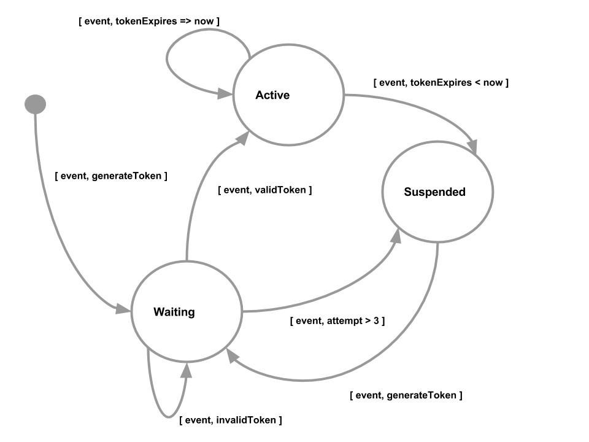

# State Machines & Queues
A common data pattern revolves around managing state and ensuring that transitions between states happen in a consistent way. This could be anything from a fulfillment process to workflows or other systems where you need to maintain state.

## Provisioning
Let's consider a simple provisioning system (see Figure­-1); it could be a signup form for a new web site, or automatic provisioning of infrastructure, etc. In this example, let's consider setting up your new Apple TV, Amazon Fire TV or Android TV device, and using one of the applications such as "Olympics 2020".



**Figure­-1: State Machine for managing relationship end transfer**

The first time you use the "Olympics 2020" application on the device, you are presented on screen with a Activation code. You then go the provider's web site with the code, enter it and after it performs a succesful entitlement request to your cable provider, the application is activated.

As can be seen from the state diagram, each of these distinct steps is modeled as a state the system needs to track. Let's looks at a simple JSON representation of this schema:

```
account: "ATV-123"
  { 'created_at': 1469744519
    'app': {
      'Olympics 2020': { 'token': "MTOB1J", 
                        'status': "Active", 
                        'expires': 1514938817 }
    }
  }
```

The code required to provision the device is straightforward:

```python
from redis import StrictRedis, WatchError
import os
import time
import random
import string
import json
import uuid
import threading

redis = StrictRedis(host=os.environ.get("REDIS_HOST", "localhost"), 
                    port=os.environ.get("REDIS_PORT", 6379),
                    db=0)
redis.flushall()

# Short expiration, to allow simpler testing, but this could be any value (e.g. 28 days)
token_expiration = 5

def create_account(device):
  redis.hset("accounts:" + device, 'created_at', long(time.time()))

def generate_token():
  return ''.join(random.choice(string.ascii_uppercase + string.digits) \
    for _ in range(6))

def do_activate(event):
  if event['token'] == "":
    event['token'] = generate_token()
  try:
    p = redis.pipeline()
    redis.watch("accounts:" + event['device'])
    account = redis.hgetall("accounts:" + event['device'])
    if 'app:' + event['service'] not in account.keys():
      data = {}
      data['app:' + event['service'] + ':status'] = "Waiting"
      data['app:' + event['service'] + ':failed'] = 0
      p.hmset("accounts:" + event['device'], data)
      p.hsetnx("accounts:" + event['device'], 'app:' + event['service'], event['token'])
      p.execute()
  except WatchError:
    print "Write Conflict: {}".format("accounts:" + event['device'])
  finally:
    p.reset()

device_id = "ATV-123"
service1 = "Olympics 2020"
token = "MTOB1J"
service2 = "NBCSports"

# Part One - Provision the device with two services
create_account(device_id)
do_activate({'device': device_id, 'service': service1, 'token': token})
print redis.hgetall("accounts:" + device_id)

do_activate({'device': device_id, 'service': service2, 'token': ""})
print redis.hgetall("accounts:" + device_id)
```

In order to track the activation token used by each application, we create a hash structure. This allows a simple keyed access, so we can directly access the entry for "Olympics 2020", without the need to iterate through a list. As we can see in the ```do_activate``` function, we can directly access the correct item in the hash. Per the state diagram in Figure­-1, the activation is put in the "Waiting" state, ready for the next steps.

When you run the code, you will see the following:

```
>>> create_account(device_id)
>>> do_activate({'device': device_id, 'service': service1, 'token': token})
>>> print redis.hgetall("accounts:" + device_id)
{'app:Olympics 2020:failed': '0', 'app:Olympics 2020:status': 'Waiting', 'created_at': '1516751715', 'app:Olympics 2020': 'MTOB1J'}
>>> 
>>> do_activate({'device': device_id, 'service': service2, 'token': ""})
>>> print redis.hgetall("accounts:" + device_id)
{'app:Olympics 2020': 'MTOB1J', 'app:NBCSports:status': 'Waiting', 'app:NBCSports': 'NVTCAT', 'created_at': '1516751715', 'app:Olympics 2020:failed': '0', 'app:Olympics 2020:status': 'Waiting', 'app:NBCSports:failed': '0'}
```

## Avoiding Updates by Other Threads and Processes
Since we are first reading the hash and then setting values at a later stage, we use the [compare-and-set pattern](https://redis.io/topics/transactions#optimistic-locking-using-check-and-set). Distilling the code from above we have the following pattern:

```python
my_key = 123
try:
  p = redis.pipeline()
  redis.watch(my_key)
  # any key updates are put here
  p.execute()
except WatchError:
  print "Write Conflict: {}".format(my_key)
finally:
  p.reset()
```

First a ```watch``` is created for the key we are interested in, we can then continue to set values within a Transaction (and since this is Python, we use the ```pipeline``` construct) until the Transaction is executed. If the key was changed, then an exception will be thrown when the transaction is executed. There are several ways we can deal with that (e.g., re­query the record and try the transaction again, return an error to the user, compensate on failure etc.), but that is beyond the scope of this article. The key point is that you can track these changes  - and act on them - programmatically.

## Tracking Service Activation Attempts
When a service tries to activate, then we want to track the following:
* Valid token for activation
* Invalid token for activation
  * Attempts are <= 3
  * Attempts are > 3

Lets look at the code to support this entitlement flow:

```python
def do_entitlement(event):
  p = redis.pipeline()
  try:
    redis.watch("accounts:" + event['device'])
    account = redis.hgetall("accounts:" + event['device'])
    if 'app:' + event['service'] in account.keys():
      service_rec = {}
      if account['app:' + event['service'] + ':status'] == "Waiting":
        if account['app:' + event['service']] == event['token']:
          # Matching token, activate service
          service_rec['app:' + event['service'] + ':failed'] = 0
          service_rec['app:' + event['service'] + ':status'] = 'Active' 
          p.hmset("accounts:" + event['device'], service_rec)
          p.hsetnx("accounts:" + event['device'], 'app:' + event['service'] + ':expires', long(time.time() + token_expiration))
          p.execute()       
        else:
          # Token not matched, determine if the account needs to be suspended
          if int(account['app:' + event['service'] + ':failed']) < 3:
            # increment and update last timestamp
            p.hincrby("accounts:" + event['device'], 'app:' + event['service'] + ':failed', 1)
            p.execute()
          else:
            # Exceeded limit
            service_rec['app:' + event['service'] + ':status'] = "Suspended"
            p.hmset("accounts:" + event['device'], service_rec)
            p.execute()
      elif account['app:' + event['service'] + ':status'] == "Active":
        if long(account['app:' + event['service'] + ':expires']) >= long(time.time()):
          # Token not expired, so update
          service_rec['app:' + event['service'] + ':failed'] = 0
          p.hmset("accounts:" + event['device'], service_rec)
          p.execute()
        else:
          # Token expired, so suspend
          service_rec['app:' + event['service'] + ':failed'] = 0
          service_rec['app:' + event['service'] + ':status'] = 'Suspended' 
          p.hmset("accounts:" + event['device'], service_rec)
          p.hdel("accounts:" + event['device'], 'app:' + event['service'] + ':expires')
          p.execute()
      elif account['app:' + event['service'] + ':status'] == "Suspended":
        # Generate new Token and transition back to Waiting state
        if event['token'] == "":
          service_rec['app:' + event['service']] = generate_token()
        else:
          service_rec['app:' + event['service']] = event['token']
        service_rec['app:' + event['service'] + ':failed'] = 0
        service_rec['app:' + event['service'] + ':status'] = 'Waiting' 
        p.hmset("accounts:" + event['device'], service_rec)
        p.execute()
  except WatchError:
    print "Write Conflict: {}".format("accounts:" + event['device'])
  finally:
    p.reset()

# Entitlement will move the state for "NBCSports", if the tokens match
do_entitlement({'device': device_id, 'service': service1, 'token': token})
print "service: {} is {}".format(service1, redis.hget("accounts:" + device_id, "app:" + service1 + ":status"))
```

While the ```do_entitlement``` function shoudl probably be broken down, the code is kept together so that you can see the processing of the various states. It checkes the current state to determine what processing needs to occur, and then transitions to the various other states, depending on the evaluation of the current state. When you run the code, you will see the following transition from ```Waiting``` to ```Active```.

```
>>> do_entitlement({'device': device_id, 'service': service1, 'token': token})
>>> print "service: {} is {}".format(service1, redis.hget("accounts:" + device_id, "app:" + service1 + ":status"))
service: Olympics 2020 is Active
```

We can also test the state transition from ```Waiting``` to ```Suspended``` when we exceed the number of attempts:
```
>>> # Tokens do not match, so state of "ABC" is moved to Suspended after 3rd failed attempt
... for i in range(4):
...   do_entitlement({'device': device_id, 'service': service2, 'token': token})
...   print "service: {} is {}".format(service2, redis.hget("accounts:" + device_id, "app:" + service2 + ":status"))
... 
service: NBCSports is Waiting
service: NBCSports is Waiting
service: NBCSports is Waiting
service: NBCSports is Suspended
```

## Queues
Queues are a common structure when you need some guarantees of order, especially when you are processing a set of events with many separate processes or threads.

## Tracking Devices
Let's say the marketing team at NBC wanted to know every new service activation so that they could send you an offer. You would not want to hold up the activation process from happening, so this means that the activation now consists of two things:
* Activate the service for the device
* Add the device as eligible for offers, etc.

There are several ways to model this, but for our example, let's use a queue. What we will do is use the service activation request event to add an item to a queue. Then, all the interested processes can use this record to trigger subsequent processing as can be seen in Figure-2. T


**Figure­-2: State Machine for queue flow**

This means that we do not need multi­record transactions to activate and extend offers. We have one record that several separate processes can now manipulate independently; its simple to extend this state machine to subscribe to events and process them - but will cover the Publish/Subscribe pattern is a [later article](../pub_sub/README.md)

Here's an example of what that would look like in JSON:

```
events: "todo"
  [ "ea498100-bd87-48dc-bb0d-79064ee6d8c4" ]

events: "provision"
  [ ]

events: "entitlement"
  [ ]

event_payload: "ea498100-bd87-48dc-bb0d-79064ee6d8c4"
  { 'service': "NBC Sports", 
    'device': "ABC-123", 
    'token': "MTOB1J",
    'last_step': "start",
    'ts': 0
  }

```

In the above example, we are going to use the ```todo``` list to track new incoming requests and the ```provision``` and ```entitlement``` lists to track the separate workflows. The ```event_payload``` is used to store the details about the actual event being processed, in a hash to allow for simple acccess to the individual attributes. The queues themselves simple contain the unique ID of the event stored in ```event_payload```.

Let's take a look at the code to support this:

```python
def transition(queue, from_state, to_state, invoke):
  # Take the next todo and create new entries into each workflow
  p = redis.pipeline()
  id = redis.brpoplpush("events:" + queue + ":" + from_state, "events:" + queue + ":" + from_state, 1)
  if id != None:
    try:
      redis.watch("event_playload:" + id)
      event = redis.hgetall("event_payload:" + id)
      if event['last_step'] == from_state:
        invoke(event)
        data = { 'ts': long(time.time()), 'last_step': to_state }
        p.hmset("event_payload:" + id, data)
        p.execute()
        print "Executed: Q:{} ID:{} S:{} FN:{}".format(queue, id, from_state, invoke.__name__)
      elif event['last_step'] == to_state:
        p.lrem("events:" + queue + ":" + from_state, 0, id)
        p.lpush("events:" + queue + ":" + to_state, id)
        p.execute()   
        print "Transitioned: Q:{} ID:{} F:{} T:{}".format(queue, id, from_state, to_state)
    except WatchError:
      print "Write Conflict: {}".format("event_payload:" + id)
    finally:
      p.reset()
```

The ```transition``` function handles the queues and the transition of tasks between the queues. We use [```BRPOPLPUSH```](https://redis.io/commands/brpoplpush) to form a [circular list](https://redis.io/commands/rpoplpush#pattern-circular-list), as we pop the next item we add back on the end of the list. The ```B```locking version of this function ([RPOPLPUSH](https://redis.io/commands/poplpush) is the non-blocking version) simply will wait for an item to be added to the list, or for the timeout to occur (which we set to 1 second to make testing simpler). The first time we see the ```event``` we invoke the function ```fn()``` that is passed as a parameter and update the hash on compeltion. The second time we see the ```event``` we remove it from the source list and add it to the target list, if effect transitioning the state of the ```event``` and making it ready for the next step in the process.


Each state handler is then defined in a simple wrapper function of the ```transition``` function, specifiying the from and to states, plus the function to execute.

```python
def process_start(queue):
  transition(queue, from_state="start", to_state="todo", invoke=do_start)

def process_activation(queue):
  transition(queue, from_state="todo", to_state="provision", invoke=do_activate)

def process_entitlement(queue):
  transition(queue, from_state="provision", to_state="entitlement", invoke=do_entitlement)

def process_finish(queue):
  transition(queue, from_state="entitlement", to_state="end", invoke=do_finish)
```

To complete the code for the device workflow:

```python
def create_activation(queue, device, service, token):
  data = { 'service': service, 
           'device': device, 
           'token': token,
           'last_step': "start",
           'ts': 0
          }
  id = str(uuid.uuid4())
  p = redis.pipeline()
  p.rpush("events:" + queue + ":start", id)
  p.hmset("event_payload:" + id, data)
  # p.expire("event_payload:" + id, 120)
  p.execute()

# Create the activation event
device_id = "MYTV-678"
create_account(device_id)
create_activation("new-device", device_id, "CNN", token)
```

Now the ```event``` has been created, we need to call the functions that will process the events. In reality, these would be encapsulated in Threads that would process the queues, the complete code for that is inlcuded in the [source files](./all.py). Here's a simple loop to process the oustanding events.

```python
# Process the outstanding todo
while True:
  process_start("new-device")
  process_activation("new-device")
  process_entitlement("new-device")
  process_finish("new-device")
  if int(redis.get("events_oustanding")) == 0:
    break

print redis.hgetall("accounts:" + device_id)
```

When the code is run, you will see the following output

```
>>> # Process the outstanding todo
... while True:
...   process_start("new-device")
...   process_activation("new-device")
...   process_entitlement("new-device")
...   process_finish("new-device")
...   if int(redis.get("events_oustanding")) == 0:
...     break
... 
Executed: Q:new-device ID:91714146-5bb4-4c4e-aede-4d09b36f39f2 S:start FN:do_start
Transitioned: Q:new-device ID:91714146-5bb4-4c4e-aede-4d09b36f39f2 F:start T:todo
Executed: Q:new-device ID:91714146-5bb4-4c4e-aede-4d09b36f39f2 S:todo FN:do_activate
Transitioned: Q:new-device ID:91714146-5bb4-4c4e-aede-4d09b36f39f2 F:todo T:provision
Executed: Q:new-device ID:91714146-5bb4-4c4e-aede-4d09b36f39f2 S:provision FN:do_entitlement
Transitioned: Q:new-device ID:91714146-5bb4-4c4e-aede-4d09b36f39f2 F:provision T:entitlement
Executed: Q:new-device ID:91714146-5bb4-4c4e-aede-4d09b36f39f2 S:entitlement FN:do_finish

>>> print redis.hgetall("accounts:" + device_id)
{'app:CNN:expires': '1516752042', 'created_at': '1516752023', 'app:CNN': 'MTOB1J', 'app:CNN:status': 'Active', 'app:CNN:failed': '0'}
```
## Consideration - or what else do I need to think about?
The above examples rely on the semantics of a single Redis server. If we consider the code in the ```transition``` function we can see commands that effect multiple keys in a single transaction:

```python
  p.lrem("events:" + queue + ":" + from_state, 0, id)
  p.lpush("events:" + queue + ":" + to_state, id)
  p.execute()   
```

In a Redis Cluster environment, the Transaction is only valid if all the keys are on the same, single server. We will revisit this problem in [another article](../cluster/README.md) and how [Key Hash Tags](https://redis.io/topics/cluster-spec#keys-hash-tags) can be used to eligantly solve this problem.

## Summary
As you can see, building and manipulating data models to support state machines, queues and other structures is straight-forward with Redis.

In the [next article](../inventory/README.md), we will discuss how to manage a finite (and perishable) resource like tickets sales for the Olympics, and how to deal with reservations that you may need to back out on.